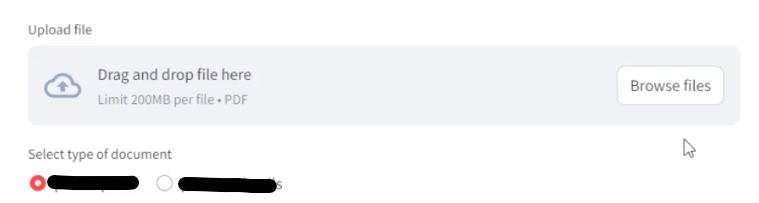
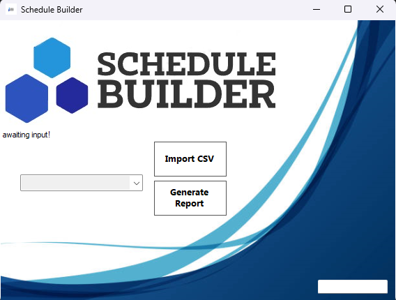

# Report Builder

A custom report-building application designed to generate CSV reports from SQL Server databases and export them to Excel. Will also map CPT codes based on Ord Procedures to increase billing code accuracy in healthcare settinsgs. This is a static reporting model I created with a lot of room for customizability. (for future projects that I create that include file conversions like this, I will instead make the menu a drag-and-drop to automatically generate the new file - much more user friendly, and will look a lot more professional)


## Features

- Generate reports based on exact SQL queries.
- Export reports in Excel and CSV formats.
- Manage configurations using `appsettings.json`.
- Supports multiple database connections if you wanted to build a reporting structure for them.

## GUI Preview



## Prerequisites

Before running the application, ensure you have the following installed:

- [.NET SDK](https://dotnet.microsoft.com/download)
- [Visual Studio](https://visualstudio.microsoft.com/) (with `.NET Desktop Development` workload)
- SQL Server (optional, if needed for database connections to retreive csv file formats)

## Installation Instructions 

1. **Clone the Repository**:
    ```bash
    git clone https://github.com/your-username/report-builder.git
    ```
2. **Open the Project**:
   - Open the project in **Visual Studio** or **Visual Studio Code**.
   - If using Visual Studio, open the `.sln` file.
   - If using VS Code, open the project folder.

3. **Restore Dependencies**:
   - In the terminal, restore all dependencies using:
     ```bash
     dotnet restore
     ```

4. **Build the Project**:
   - Build the solution using:
     ```bash
     dotnet build
     ```

5. **Run the Application**:
   - To run the project: (you can also do all of the above via the VS menu items)
     ```bash
     dotnet run
     ```

## Configuration

- **Database Connection**:
  - Update the `appsettings.json` file to include your SQL Server connection string.
  
    Example:
    ```json
    {
      "ConnectionStrings": {
        "DefaultConnection": "Server=myServerAddress;Database=myDataBase;User Id=myUsername;Password=myPassword;"
      }
    }
    ```

## Usage

1. Open the application and select the type of report you'd like to generate.
2. Customize the SQL queries based on your requirements.
3. Choose the export format (Excel or CSV).
4. Click **Generate** to run the report and save it to your machine.

## Contributions

This is a personal project that I made to solve a few issues at work, so PRs may not be accepted. The code is public domain though, so feel free to fork and do whatever you want with it.


